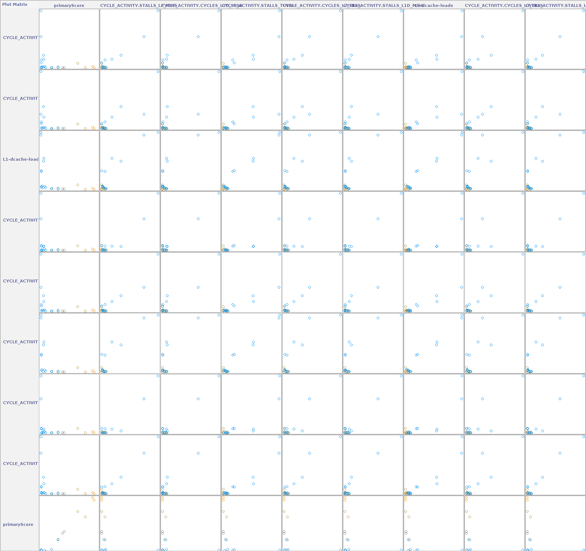
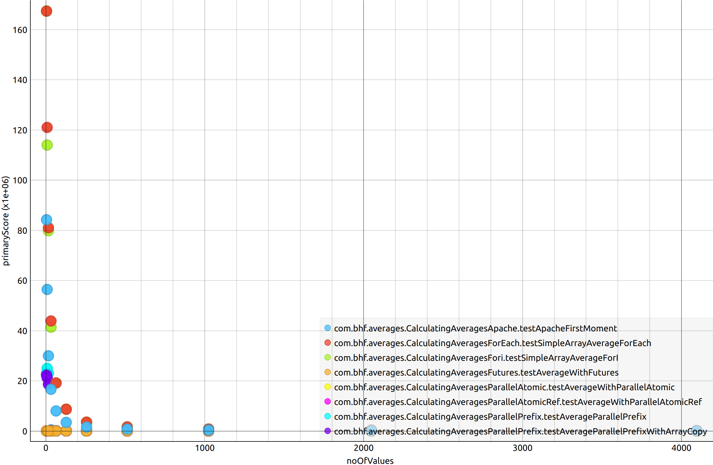
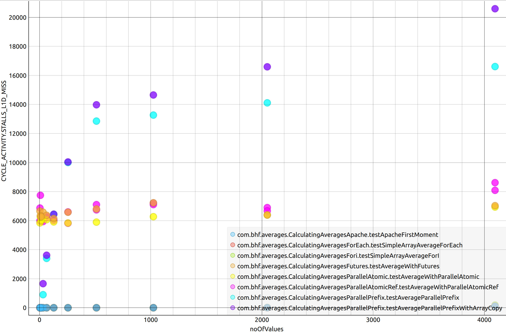
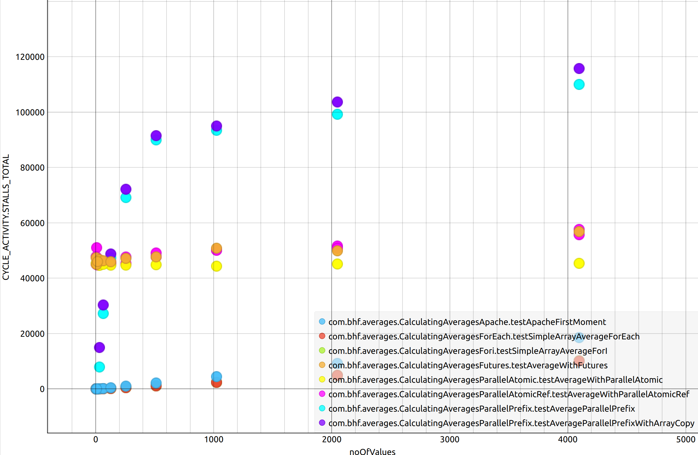
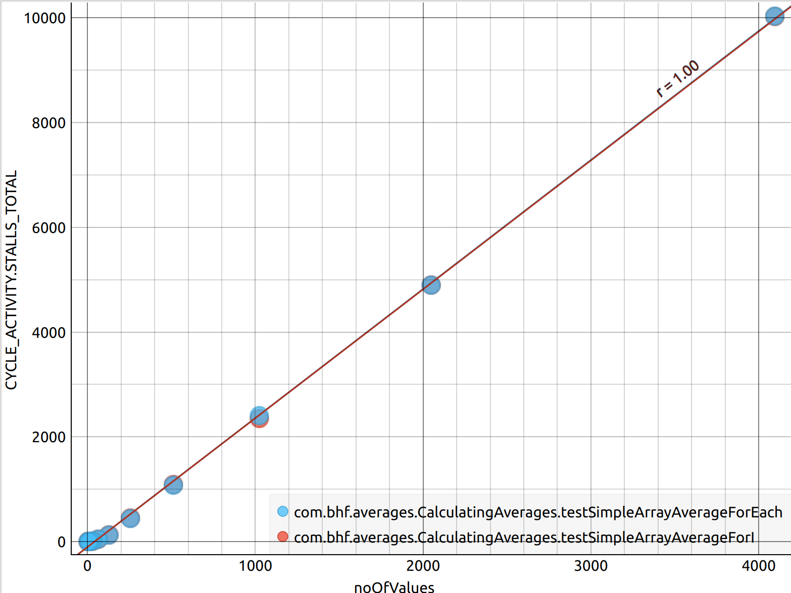

# jmh-playground

Some JMH benchmarks and analysis of array averaging. I mostly wrote this to refine my JMH process, not to try and find the average of an array in the fastest way. 

It's important to identify when a lot of our features are related or mean nearly the same thing. It's also useful to divide up results by the parameters you're testing e.g. all values vs. params in a specific range.

## How much value do we really get from all these monitors? ##
 

## Array Size vs. Ops/sec ##
 

## Array Size vs. L1 Data Misses ##
 

## Array Size vs. Total Stalls ##
 

## Array Size vs. Total Stalls For Base Case ##
 

## Array Size vs. Total Stalls For Small Arrays ##
 
