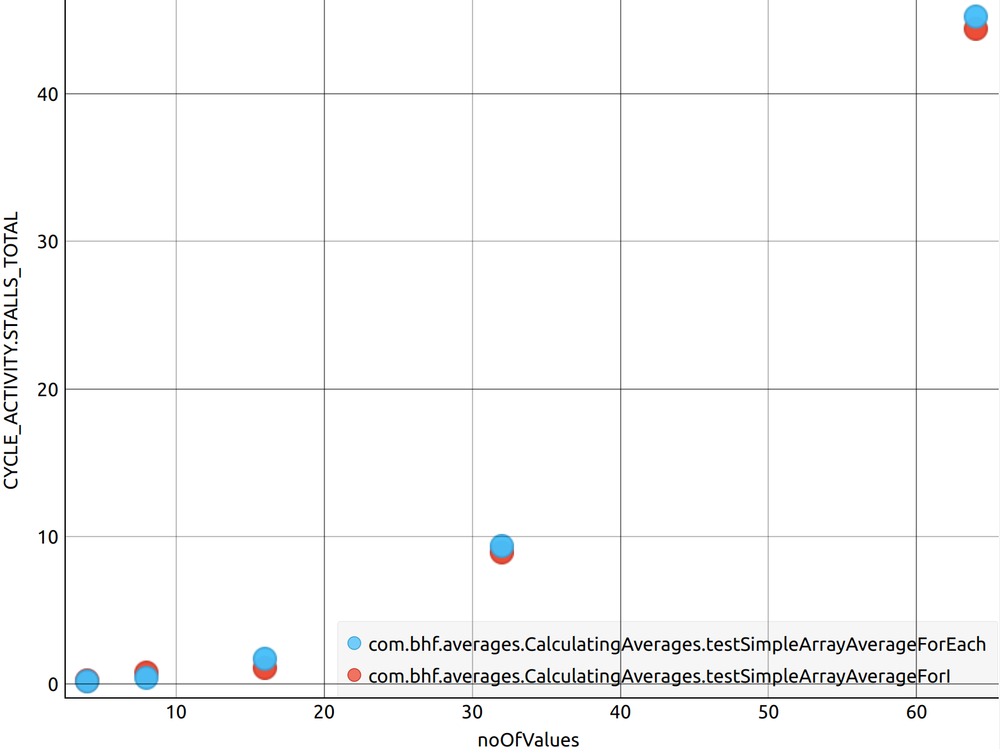

# jmh-playground

Some JMH benchmarks and analysis of array averaging. I mostly wrote this to refine my JMH process, not to try and find the average of an array in the fastest way. 

## How much value do we really get from all these features? ##
 

## Array Size vs. Ops/sec ##
 

## Array Size vs. L1 Data Misses ##
 

## Array Size vs. Total Stalls ##
 

## Array Size vs. Total Stalls For All Sizes ##
 

## Array Size vs. Total Stalls For Small Arrays ##
Example of dividing up the parameter space

 
